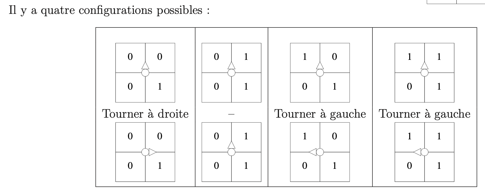

*Gros Maxime, Vasilis Skarleas*

---

# Rapport

## Tache 1 - Image Bitmap

Dans cette première tache le plus dur fut de compendre comment on allait s'y prendre pour extraire les données de chaque image bitmap (en évaluant chaque pixel par noir ou blanc).

Lors de cette première tache on a dut construire les bases de notre codes qui sont de extraire les données d'une image, on sauvegarde donc dans un premier temps la taille de l'image et on enregistre dans un tableau les coordonnées de chaque pixel noir.

### Structures de données

Dans cette tache pour la realisation des fonctions *ecrire_image* et *negatif_image* on utilise la structure de base d'une image bitmap qui est compose de la largeur de l'image, la hauteur de l'image et un pointeur vers le tableu de pixels.

### Structure du programme

Pour la tache 1, le code principal des fonctions *ecrire_image* et *negatif_image* sont inclus sur le fichier *image.c* qui viens avec un fichier de liaisons *image.h*

### Difficultés, problems et resolutions

*Dans cette partie du rapport final on decrit en bullets les differents problemes avec la resolution finale pour resoudre ce probleme, ainsi que differents points qu'on a trouvé difficile pendant la realisation des taches.*

Pour la Tache 1:

* Utilisation du profil de l'image pour recuperer la hauter et la largeur au lieu d'utiliser les fonctions déja definis au debut du projet (source code initial)
  * On a modifié la syntax sur nos fonctions *ecrire_image* et *negatif_image* pour faire une appelle aux fonctions hauteur_image et largeur_image.
* Retouner une image negative sans modification de l'image original
  * Initialisation d'une image en utilisant la fonction creer_image, tout en declarant son hauteur et sa largeur par rapport l'hauteur et la largeur de l'image initial.
* Probleme de la bonne lecture de l'image initial (soit pour effectuer un affichage sur le terminal en utilisant 0 et 1, soit pour creer le negatif de cette image) aux fonctions *ecrire_image* et *negatif_image*.
  * Initialisation de la variable de parcours largeur-hauteur (boucle imbroques) à 1

    ```c
    for (int i=1; i<=hauteur; i++)
    	{
    		for (int j=1;j<=largeur; j++)
    		{ 
    ...
    ```

    au lieu de 0

    ```c
    for (int i=0; i<hauteur; i++)
    	{
    		for (int j=0;j<largeur; j++)
    		{
    ...
    ```
* Avoir une lecture des pixels le plus efficace pour les fonctions *ecrire_image* et *negatif_image*
  * Utilisation de la syntax switch(A), avec A la couleur du pixel en question
    ```c
    ...
    A = get_pixel_image(I, j, i);
    		switch(A)
    			{
    				case(BLANC):
    					...
    					break;
    				default:
    					...
    					break;
    			}
    ...
    ```

## Tache 2 - Géométrie 2D

Maintenant l'objectif de cette tache est de créer les différents objets/fonctions mathématiques que nous aurions besoin dans le reste du projets.

Tous ces objets peuvent être trouver dans le fichier *geom2d.h* ,il sera compléter au fur et à mesure mais la plus grosse partie des fonctions géométrique qu'on utlisera seront créer lors de cette tache. La création du type point qu'on utilisera durant tous le projet sera créer à ce moment là.

### Structure du programme

Pour la meileur organisation des fichier de code, on a créé un nouveau fichier nomme *geom2d.c* qui inclut toutes les fonctions qui correspondent en calcul geometrique en dimension 2.

De plus, on a construit le fichier *geom2d.h* dans lequel on a declaré les structures de données utilisés par les modules sur *geom2d.c*. Aussi, ce fichier inclut le profil de chaque focntion ecrit sur *geom2d.c*

### Structures de données

Dans cette partie du projet, on aura besoin de declarer les types Vecteur et Point. Leur structure est donnes ci-dessous (*geom2d.h*)

```c
//Type Vecteur 
typedef struct Vecteur_
{
   double x,y;
} Vecteur;

//Type Point 
typedef struct Point_
{
   double x,y;
} Point;
```

### Difficultés, problems et resolutions

* Devrait utiliser des fonctions mathematiques en C. Par exemple: sqrt() pour la racine d'un nombre reel

  * On a definit *<math.h>* sur *geom2d.c*
* Choisir le bon typage pour les fonctions geometrqiues en plan de dimension 2

  * Utiliser le type double pour les fonctions de la norme, de la distance et du produit scalaire

## Tache 3 - Extraction d'un contour externe

### Structure du programme

Dans cette partie du projet, on a cree un nouveau fichier qui s'appele *contour.c*. À partir de cette tache, c'est ce fichier qu'on va mettre à jour majoritement. Pour la tache 3, on a declaré toutes les fonctions necessaires pour l'extraction d'un contour externe via la methode d'un robot virtuel.

Cela veut dire que l'on créé toutes les fonctions d'initialisation du robot, lecture de la position, mis à jour de ses coordonees et orientation, declaration de l'agorithme pour l'extraction d'un seul contour, ainsi que la recherche du pixel de depart (pixel par lequel on va commencer de chercher pour un contour). Effectivement, le fichier contour.c viens avec le fichier contour.h qui inclut la declaration de la structure des donnees pour le robot virtuel et son orientation ainsi que les profils de toutes les fonctions.

De plus, on a declaré un fichier qui s'appelle *sequence_point.c*. Il s'agit d'un fichier essentiel qui inclut toutes les aides de traitement des structures des donnees declaré sur *sequence_point.h*. À partir de l'application de l'agorithme de contour (chercher pour un contour externe), on a besoin de stoquer tous les points du contour pour faire son extraction. C'est pourquoi, on a besoin de declarer des nouveaux types (structures des donnes).

Comme expliqué dans la partie ***structures de données - sequence_point.h***, l'utilisation des listes chainées est essentiel. Dans ce cadre la, les aides de traitement pour les liste de points, il s'agit des fonctions de concatenation de listes, de suppresions d'elements, initialisation d'une telle liste, ajouter des elements dans une liste, ainsi que transformation d'une telle liste vers un tableau (qu'on aura besoin aux prochaines taches).

### Structures de données

#### sequence_point.h

Vu qu'on ne connait pas le nombre exact des points d'un contour externe, on a besoin de declarer une liste des points (contour) avec un taille dynamique. C'est pourquoi on utilise la syntax d'une liste chainé. Effectivement, une liste chaine est une chaine de cellules a laquelle son ensemble construit la liste chainé. Alors on a:

```c
...
/*---- le type cellule de liste de point ----*/
typedef struct Cellule_Liste_Point_
{
	Point data;    /* donn�e de l'�l�ment de liste */
	struct Cellule_Liste_Point_* suiv; /* pointeur sur l'�l�ment suivant */
} Cellule_Liste_Point;

/*---- le type liste de point ----*/
typedef struct Liste_Point_
{
	unsigned int taille;        /* nombre d'�l�ments dans la liste */
	Cellule_Liste_Point *first; /* pointeur sur le premier �l�ment de la liste */
	Cellule_Liste_Point *last;  /* pointeur sur le dernier �l�ment de la liste */
	                       /* first = last = NULL et taille = 0 <=> liste vide */
} Liste_Point;

typedef Liste_Point Contour; /* type Contour = type Liste_Point */
...
```

Pour la transformation d'une liste chaine vers un tableau, on a besoin de declarer le typage d'un tel tableau. Alors on a:

```c
...
/*---- le type tableau de point ----*/
typedef struct Tableau_Point_
{
	unsigned int taille; /* nombre d'�l�ments dans le tableau */
	Point *tab;          /* (pointeur vers) le tableau des �l�ments */
} Tableau_Point;
...
```

---

#### contour.h

On declare comme type enumere l'orientation qui peut etre pris par le robot. Après, on commence avec la declaration du robot virtuel qui a besoin des coordonees (x,y) et l'orientation. Alors on a:

```c
...
typedef enum {Nord, Est, Sud, Ouest} Orientation;

typedef struct {
  int x, y;
  Orientation o;
} Robot;
...
```

### Difficultés, problems et resolutions

* Trouver la signature de l'algo de contour (*algo_contour*)
  * On a decidé de prendre une image et un nom du fichier. En ce qui concerne le fichier, il s'agit d'un fichier .txt qui inclus les points d'un contour (tres utile pour la verification que la fonction marche comme attendue)
* Possibilité d'ecrire sur le fichier les differents points du contour sans lire le contour en utilisant des cellules vu que cette notion n'etait pas trés claire dans notre tete pendant la periode de realisation de cette tache.
  * Transformation du contour (liste des points [liste chainé]) à un tableau. Aprés on fait un parcours normal du tableau, tout en ecrivant sur le fichier (*fptr*) le coordonees du chaque point (*P.x* et *P.y*)
    ```c
    ...
    Tableau_Point TP = sequence_points_liste_vers_tableau(c);
            int k;
            int nP = TP.taille;
            fprintf(fptr, "\n");
            fprintf(fptr, "%d\n", nP);
            for (k = 0; k < nP; k++)
            {
                Point P = TP.tab[k];
                fprintf(fptr, "%.1f %.1f\n", P.x, P.y);
            }
            free(TP.tab);
    ...
    ```
* Etablir une logique pour trouver le point de depart
  * Dans le cadre de la lecture de l'image original, si on trouve un pixel noir tel que son voisin en nord est blanch, on retourne cette pixel (ses coordones x et y) comme le point de depart. Pour le pixel voisin il suffit de regarder en meme largeur mais en hauteur-1 de notre pixel en question comme marqué ci-dessous:
    ```c
    ...
    case (NOIR):
                    if (j != largeur)
                    {
                        voisin = get_pixel_image(I, j, 
    ```
* L'agorithme de contour demande de calculer la nouvelle orientation du robot pour qu'on puisse bien suivre le contour externe. La detection des bons pixels-voisin autour de notre pixel en question par rapport l'orientation du robot etait essentiel:
  * On a decidé d'avancer en divisant notre problem en 4 sous-cas qui dependent par l'orientation du notre robot. Après, en utilisant l'image "voisins d'un point (x,y)" on recupere les bonnes pixels voisins à gauche et à droit, et par rapport la logique expliqué sur l'image "configurations possibles", on decide la nouvelle orientation du robot.
    ")

    
    Alors on obtiens la loqique suivante:

    ```c
    ...
    switch (r->o)
        {
        case (Est):
            pG = get_pixel_image(I, x + 1, y);
            pD = get_pixel_image(I, x + 1, y + 1);
            if (pG == NOIR)
            {
                r->o = Nord;
                break;
            }
            else if (pD == BLANC)
            {
                r->o = Sud;
                break;
            }
            else
            {
                break;
            }
        case (Nord):
            pG = get_pixel_image(I, x, y);
            pD = get_pixel_image(I, x + 1, y);
            if (pG == NOIR)
            {
                r->o = Ouest;
                break;
            }
            else if (pD == BLANC)
            {
                r->o = Est;
                break;
            }
            else
            {
                break;
            }
        case (Sud):
            pG = get_pixel_image(I, x + 1, y + 1);
            pD = get_pixel_image(I, x, y + 1);
            if (pG == NOIR)
            {
                r->o = Est;
                break;
            }
            else if (pD == BLANC)
            {
                r->o = Ouest;
                break;
            }
            else
            {
                break;
            }
        case (Ouest):
            pG = get_pixel_image(I, x, y + 1);
            pD = get_pixel_image(I, x, y);
            if (pG == NOIR)
            {
                r->o = Sud;
                break;
            }
            else if (pD == BLANC)
            {
                r->o = Nord;
                break;
            }
            else
            {
                break;
            }
        }
    ...
    ```
* On avait un probleme quand rapport le robot doit tourner à gauche ou à droite .
  * Effectivement, c'est l'orientation du robot qui change si on tourne à gauche ou à droit. Avec une beaucoup de reflection on a obtenu la logique suivante:
    ```c
    ...
    void tourner_a_gauche(Robot *r)
    {
        switch (r->o)
        {
        case Nord:
            r->o = Ouest;
            break;
        case Ouest:
            r->o = Sud;
            break;
        case Sud:
            r->o = Est;
            break;
        case Est:
            r->o = Nord;
            break;
        }
    }

    /* faire tourner le robot à droite */
    void tourner_a_droite(Robot *r)
    {
        switch (r->o)
        {
        case Nord:
            r->o = Est;
            break;
        case Ouest:
            r->o = Nord;
            break;
        case Sud:
            r->o = Ouest;
            break;
        case Est:
            r->o = Sud;
            break;
        }
    }
    ...
    ```

## Tache 4 - Sortie fichier au format EPS

### Structure du programme

Dans le fichier contour.c on ajouté les fonctions *create_postscript* et *create_postscript_fill* qui construit le fichier EPS. Effectivement, le fichier contour.h etait mis à jour avec les profils des nouvelles fonctions.

### Structures de données

Pas de nouvelles structures sont crée. On utilise la structure de données liste_point pour la realisation de cette tache.

### Difficultés, problems et resolutions

* Comment automatiser le processus de la creation et l'ouverture d'un fichier .EPS à partir d'un fichier .PBM passé en argument
  * Utilisation de la fonction pre-declare en C strtok pour recuperer le nom du fichier sans l'extension  .PBM, tout en allocant la memoire necessaire pour l'ajout de l'extension .EPS en utilisant le malloc et creation du nom final avec l'extension .eps
    ```c
    ...
    // Extension managment
        char *no_extension = strtok(file_name, ".");
        char *with_extension = malloc(strlen(no_extension) + 4);
        strcpy(with_extension, no_extension);
        strcat(with_extension, ".eps");
    ...
    ```
* Image sur le fichier EPS etait affiché à l'inverse
  * Modification de la valeur *y* d'un point avec hauteur de l'image moins sa valeur initial comme marqué ci-dessous:
    ```c
    ...
    Cellule_Liste_Point *el;
        el = c.first;
        fprintf(fptr, "%.0f %.0f moveto ", el->data.x, hauteur-el->data.y);
        el = el->suiv;
        while (el != NULL)
        {
            fprintf(fptr, "%.0f %.0f lineto ", el->data.x, hauteur-el->data.y);
            el = el->suiv;
        }
    ...
    ```
* N'oubliez pas d'ajouter le *setlinewidth* sur le fichier EPS
* Faire atention en mode de remplisage (fill ou stroke)

## Tache 5 - Extraction des contours d'une image

### Structure du programme

Dans le fichier contour.c on ajoute la fonction algo_contours qui renvoie la liste des contours pour une image. Pour etre capable de detecter tous les contours d'une image on a besoin d'un mask de l'image originale. Il s'agit d'une image dont tous les pixels noirs de l'image originale qui ont un pixel blanc au nord sont répertorié.

Alors, au lieu de chercher le point de depart de chaque contour dans l'image originale, on le cherche dans l'image mask qui est mis à jour chaque fois qu'un point est mis sur le contour en question.

Effectivement, on a besoin une maniere de detecter qu'il n'y plus de contours pour l'image orginale. C'est pourquoi, on a construit la fonction *image_mask* qui verifie si il y a ou pas des pixels noirs ou si l'image a que des pixels blanches. Si l'image mask a que des pixels blanches, alors ça veut dire qu'il n'y a pas d'autres contours à extraire.

Dans le cadre des compte rendus pour le Tache 5, on avait besoin d'ajouter d'autres fonctions sur le fichier contour.c. Il s'agit des fonctions:

1. *ecrire_fichier_contours*: Creer un .TXT avec tous les contours au lieu d'un seul contour comme on avait fait en Tache 4
2. *contours_data*: Il affiche sur le terminal le nombre des contours et le nombre des segments totales
3. *create_postscript_contours*: Ecriture du fichier .EPS pour un multiple des contours

Evidement, les profils des nouvelles fonctions etaient ajouté sur contour.h

### Structures de données

Dans cette partie du projet, il y avait quelques additions des types sur le fichier sequence_point.h et des fonctions d'aide correspondante sue sequence_point.c. Pour etre capable de traiter le mupliple nombre des contours, on a construit un nouveau type nommé *Liste_Contours* qui est en fait une liste chainé des contours (liste_point).

Dans ce cadre là, on a construit le type Cellule_Liste_Contours qu'on a besoin de construire la liste chaine des contours. Vous pouvez trouver les structures de données consruit ci-dessous:

```c
...
/*---- le type cellule de liste de point ----*/
typedef struct Cellule_Liste_Point_
{
	Point data;    /* donn�e de l'�l�ment de liste */
	struct Cellule_Liste_Point_* suiv; /* pointeur sur l'�l�ment suivant */
} Cellule_Liste_Point;
...
typedef struct Liste_Contours_
{
	unsigned int taille;        /* nombre d'�l�ments dans la liste */
	Cellule_Liste_Contours *first; /* pointeur sur le premier �l�ment de la liste */
	Cellule_Liste_Contours *last;  /* pointeur sur le dernier �l�ment de la liste */
	                       /* first = last = NULL et taille = 0 <=> liste vide */
} Liste_Contours;
...
```

### Difficultés, problems et resolutions

* Faire le parcour de la liste des contours, tout en faisant le parcour de chaque contour dans le cadre de trouver le numero des contours et le numero des segments totales pour la fonction *contours_data*

  * On a decidé d'utiliser la methode de lecture par cellules. Alors on a:

    ```c
    ...
     Cellule_Liste_Contours *el;
        el = c.first;
        ..
        while (el != NULL)
        {
            ..
            Cellule_Liste_Point *e;
            e = (el->data).first;
            while (e != NULL)
            {
                ..
                e = e->suiv;
            }
            ..
            el = el->suiv;
        }
    ...
    ```

    .. corespond à d'autres parties du code qui n'ont pas une connection par le probleme mentioné
* Ecriture du fichier EPS pour un multiple des contours

  * On suivre la meme methode qu'au point d'avant (lecture en utilisant les cellules).
* Le pixel voisin pendant la lecture de l'image originale pour la construction de l'image doit etre le pixel du nord par rapport le pixel en question.

  * On fait toujours hauteur-1 pour trouver le pixel de voisin
    ```c
    ...
    voisin = get_pixel_image(I, j, i - 1);
    ...
    ```
* Ajouter chaque contour dans la liste de contours

  * On a ecrit la fonction *ajouter_element_liste_Contours* qui ajout une liste de point sur un eliste des contours (sequence_point.c)

### Extra

On trouve assez interesant le fait que pour la boucle while de l'agorithme de contours (algo_contours), on utilise une variable bool initialisé à true et qui change a false si et seulement si l'orientation du robot est Est et que ses coordones sont les memes que les coordones du point de depart.

```c
...
avancer(&robot);
rb = set_point(robot.x, robot.y);
nouvelle_orientation(&robot, rb.x, rb.y, I);

            if ((robot.o == Est) && (original_position.x == rb.x) && (original_position.y == rb.y))
            {
                repeat = false;
            }
...
```

## Tache 6 - simplification de contours par segments

### Structure du programme

Dans cette partie du projet on devrait faire une simplification des points des contours en utilisant la methode de Douglass Peucker. Effectivement, sur le fichier contour.c on a ajouté l'agorithme de cette methode et un nouveau fichier de test etait ajouté aussi (test_simplification.c - programme principal pour cette tache).

De plus, le profil de la fonction etait ajouté sur le fichier contour.h.

### Structures de données

Il n'y a pas des nouvelles structures de données crées pour cette partie du projet comme la fonction *simplification_douglas_peucker* prend directement un tableau de points (un contour) et il fait la simplification du contour en question et en meme temps, les plusieurs contours d'un image sont traites un par un sur le program principal de cette tache.

```c
...
Liste_Contours simple;
    simple = creer_liste_Contours_vide();
    Contour el;
    el = creer_liste_Point_vide();

    Cellule_Liste_Contours *al;
    al = liste.first;
    while (al != NULL)
    {
        Tableau_Point T = sequence_points_liste_vers_tableau(al->data);
        el = simplification_douglas_peucker(al->data, 0,(T.taille)-1, 1);
        ajouter_element_liste_Contours(&simple, el);
        al = al->suiv;
    }
...
```

### Difficultés, problems et resolutions

* Probleme avec la concatenation des listes 1 et 2 dans l'agorythme de Douglass

  ```c
  ...
  return concatener_liste_Point(L1, L2);
  ...
  ```

  * On avait oublié d'initiliaser les listes à chaque appel recursif
    ```c
    ...
    Contour L1;
    L1 = creer_liste_Point_vide();
    ...
    Contour L2;
    L2 = creer_liste_Point_vide();
    ...
    ```

## Tache 7 - Simplification de contours par Bézier

### Structure du programme

Un etape essentiel est d'approximer un contour vers une courbe de bezier. On a utilisé le partie theorique du TD pour consruire les fonctions *approx_bezier2* et *approx_bezier3*.

Dans le cadre d'un courbe de bezier 2, elle doit etre transformé en courbe de bezier de degree 3 pour construire le postscript, déjà on avait besoin de declarer une nouvelle fonction sur contour.c nommé *conversion_bezier2_to_bezier3*.

De plus, pour faire la simplification du Douglass Peucker tout en utilisant des courbes de Bezier, on a besoin de trouver la distance entre une courbe de bezier et un point. Du coup, on a créé les deux fonctions *distance_point_bezier2* et *distance_point_bezier3* qui ont besoin une sous-fonction chaque une qui est *calcul_ct_bezier2* et *calcul_ct_bezier3* respectivement. Les deux sous-fonctions sont responsables de trouver un segment perpendiculaire à la courbe.

À la fin, on modifie l'agorithme de Douglass Peucker utilisé sur Tache 6 et on construit comme ça les fonctions *simplification_douglas_peucker_bezier2* et *simplification_douglas_peucker_bezier3*. Effectivement, une modification sur la fonction de la creation du postscript etait necesaire pour les courbes de bezier. Alors, on deux nouvelles fonctions *create_postscript_contours_bezier2* et *create_postscript_contours_bezier3.*

Pour conclure, pour repondre aux questions du Tache 7, on avait besoin d'afficher sur le terminal le nombre des courbes de Bézier. Ainsi on a construit les fonctions *contours_data_bezier* et *contours_data_bezier3*

```c
...
void contours_data_bezier(Liste_Contours c)
{
    Cellule_Liste_Contours *el;
    el = c.first;
    int nb = 0;
    int nb_beziers = 0;
    while (el != NULL)
    {
        nb++;
        Cellule_Liste_Point *e;
        e = (el->data).first;
        while (e != NULL)
        {
            e = e->suiv;
            e = e->suiv;
            e = e->suiv;
            nb_beziers++;
        }
        el = el->suiv;
    }
    printf("Nombre des contours: %d\n", nb);
    printf("Nombre des bezier totals: %d\n", nb_beziers);
    printf("\n");
}

void contours_data_bezier3(Liste_Contours c)
{
    Cellule_Liste_Contours *el;
    el = c.first;
    int nb = 0;
    int nb_beziers = 0;
    while (el != NULL)
    {
        nb++;
        Cellule_Liste_Point *e;
        e = (el->data).first;
        while (e != NULL)
        {
            e = e->suiv;
            e = e->suiv;
            e = e->suiv;
            e = e->suiv;
            nb_beziers++;
        }
        el = el->suiv;
    }
    printf("Nombre des contours: %d\n", nb);
    printf("Nombre des bezier totals: %d\n", nb_beziers);
    printf("\n");
}
...
```

### Structures de données

Vu qu'on doit travailer avec des courbes de bezier de degree 2 et 3, on devrait creer ceux nouveaux types. Ainsi dans le fichier geom2d.h on a:

```c
...
typedef struct Bezier2_
{
   Point A, B, C;
} Bezier2;

typedef struct Bezier3_
{
   Point A, B, C, D;
} Bezier3;
...
```

Par leur definition ils dependent d'un nombre different de points.

### Difficultés, problemes et resolutions

* Faux typage sur le calcul du calcul_ct_bezier2 et du calcul_ct_bezier3
  * Changement de int à double pour les x et y.
* Malecriture d'une courbe de bezier sur les instructions postscript
  * On faisait moveto sur chaque changement de courbe. On a modifié ça tout en faisant que des curveto pour les points non colineaires des courbes
    ```c
    ...
    fprintf(fptr, "%.3f %.3f moveto ", b3.A.x, hauteur - b3.A.y);
            fprintf(fptr, "%.3f %.3f %.3f %.3f %.3f %.3f curveto ", b3.B.x, hauteur - b3.B.y, b3.C.x, hauteur - b3.C.y, b3.D.x, hauteur - b3.D.y);
            el = el->suiv;
            while (el != NULL)
            {
                b2.A = el->data;
                el = el->suiv;
                b2.B = el->data;
                el = el->suiv;
                b2.C = el->data;
                b3 = conversion_bezier2_to_bezier3(b2);
                fprintf(fptr, "%.3f %.3f %.3f %.3f %.3f %.3f curveto ", b3.B.x, hauteur - b3.B.y, b3.C.x, hauteur - b3.C.y, b3.D.x, hauteur - b3.D.y);
                el = el->suiv;
            }
    ...
    ```
* On avait fait une erreur de transcription de la formule necessaire pour la fonction calcul_ct_bezier3. En fait en faisait t * t * (b3.D.x) au lieu de t * t * t * (b3.D.x). Pareil pour D.y.
* Utilisataion du type int alors qu'on devrait toujours utiliser double sur la fonction approx_bezier2 et en general aux autres endroits du code.
  * On a bien changé le type int à double si c'etait necesaire
* Il y avait un erreur sur le cas d'approximation d'un countour vers une courbe de bezier de degree 2 pour n>1
  * On a corigé la logique de la boucle sur ce cas. Alors on a:
    ```c
    ...
    else if (n >= 2)
        {
            double n_double;
            n_double = (double)(n);

            // Calcul a et b
            double a, b;
            a = (3 * n_double) / ((n_double * n_double) - 1);
            b = ((1 - (2 * n_double)) / (2 * (n_double + 1)));

            double x = 0;
            double y = 0;
            Point id;
            for (int i = j1 + 1; i < j2; i++)
            {
                id = T.tab[i];
                x = x + id.x;
                y = y + id.y;
            }

            // Transformner x et y en double
            double res_x, res_y;

            res_x = a * x + b * ((double)(C0.x) + (double)(C2.x));
            res_y = a * y + b * ((double)(C0.y) + (double)(C2.y));

            Point C1;
            C1 = set_point(res_x, res_y);

            b2.A = C0;
            b2.B = C1;
            b2.C = C2;
            return b2;
        }
    ...
    ```
* On avait une segmentation fault sur le Tache 7.2
  * On fait on faisait des appels aux fonctions construit pour les courbes de bezier de degree 2 au lieu d'appeller les bonnes fonctions. De plus, il y avait des erreurs de calcul par rapport à la boucle interne responsable pour le cas n>2 pendant l'approximation d'un contour vers une courbe de bezier de degree 3. Aussi notre i = 1 etait initialisé à i = j1 qui n'etait pas bonne aussi.

    ```c
    ...
    for (int i = 1; i < n; i++)
            {
                i_dbl = (double)(i);
                alpha = (6 * i_dbl * i_dbl * i_dbl * i_dbl) - (8 * n_double * i_dbl * i_dbl * i_dbl) + (6 * i_dbl * i_dbl) - (4 * n_double * i_dbl) + (n_double * n_double * n_double * n_double) - (n_double * n_double);

                id = T.tab[j1 + i];
                x = x + alpha * (id.x);
                y = y + alpha * (id.y);
            }
    ...
    ```

    On a corigé des erreurs sur le calcul de a et b toujours pour n>2, tout en verifiant que le n utilisé sur le calcul est du type double

    ```c
    ...
    double n_double;
            n_double = (double)(n);

            // Calcul a et b
            double a, b, lambda;
            a = (-15 * n_double * n_double * n_double + 5 * n_double * n_double + 2 * n_double + 4) / (3 * (n_double + 2) * (3 * n_double * n_double + 1));
            b = ((10 * n_double * n_double * n_double - 15 * n_double * n_double + n_double + 2) / (3 * (n_double + 2) * (3 * n_double * n_double + 1)));
            lambda = (70 * n_double) / (3 * (n_double * n_double - 1) * (n_double * n_double - 4) * (3 * n_double * n_double + 1));
    ...
    ```
* On avait une difficulté pour concatener un string avec un nombre pendant la creation automatique des fichiers .EPS et .TXT sur le programme principal
  * On utilise la fonction deja declare en C snprintf

    ```c
    ...
    snprintf(exit_file, (strlen(name)+20), "%s-deg3-taille%.0f.txt", name, d );
    ...
    ```

## Tache 8

### Remarque

Dans la partie Tache 8.1 il etait demandé de tester la simplification par segments ainsi que le temps d'execution de notre code. En fait, pour une image de grande taille, le program faisait un killed.

On a decouvert que pendant l'appelle de la fonction simplification_douglas_peucker on passait en argument une liste chaine de points (un contour), quand on avait deja transformé en tableau cette liste, tout en retransformant cette liste vers un tableau dans la fonction. La consequence etait d'avoir deux fois l'espace memoire pour un contour et pour plusieurs contours, la taille de la memoire demandé etait enorme.

Pour resoudre le probleme, on avait effectué un changement sur le profil de la fonction simplification_douglas_peucker et son corp pour prendre un tableau directement plutot qu'une chaine.

```c
...
Tableau_Point T = sequence_points_liste_vers_tableau(al->data);
el = simplification_douglas_peucker(T, 0,(T.taille)-1, 0);
...
```

---

# Manuel utilisateur

Chaque tache de ce projet viens avec plusieurs fichiers de test qu'on ecrit specifiquement pour chaque tache dans le but de repondre aux question du compte rendu ainsi que de verifier que le programe marche comme prevu.

Ceux fichiers de test sont les prgrammes principaux que l'utilisateur doit utiliser pour chaque Tache 5, 6 ou 7. Ci-dessous vous pouvez trouver un recapitulatif des tous les tests qu'on a effectué pendant la duree du projet, ainsi que comment faire la compilation, comment executer le programme, quelles sont les donnees en entree et quels sont les resultats en sortie pour les tests des taches 5, 6 et 7.

## Tests

* Tache1: test_image
* Tache2: test_geom
* Tache3: test_contour
* Tache4: test_postscript
* Tache5: test_mask
* Tache6: test_simplification
* Tache7.1: test_approx & test_degree2
* Tache7.2: test_approx3 & test_degree3
* Tache8.1: test_simplification-courbe_hilbert_7, test_simplification-courbe_hilbert_8, test_simplification-courbe_hilbert_9, test_simplification-courbe_hilbert_10, test_simplification-zebres-1000x0750, test_simplification-zebres-2000x1500, test_simplification-zebres-3000x2250, test_simplification-zebres-4000x3750(Tache 6 folder)
* Tache8.2: test_degree2-tache8, test_degree3-tache8 & test_simplification-tache8 (Tache 7 folder)

On considere qu'on est placé sur le repertoire "Final Project" qui inclus que le [source code]() du projet.

## Tache 5

Le tache 5 depend des fichiers suivantes (compilation):

1. test_mask.c
2. contour.h
3. image.h

Pour compiler il suffit d'ouvrir un terminal et se placer sur le repertoir du source code. Taper make. L'etape suivant est de taper ./*test_mask*.

Donner le nom du fichier de l'image de la quelle vous souhaitez faire l'extraction des contours.

À la completion du programme, il y aura deux fichiers cree dans le repertoire. Un fichier .TXT avec tous les contours et ses points ainsi qu'un fichier .EPS que vous pouvez utiiser pour visiualiser l'image en utilisant un logiciel approprié.

De plus sur le terminal vous pouvez trouver les details de cette image en ce qui concerne le nombre des contours totales et les segments totals. Sur le terminal il y a aussi l'affichage de l'image initial et du mask de l'image (il est possible qu'il serait impossible de bien visualiser l'image et son mask sur le terminal à cause du grand nombre de l'hauteur et du largeur)

## Tache 6

Le tache 6 depend des fichiers suivantes (compilation):

1. test_simplification.c
2. contour.h
3. image

Pour compiler il suffit d'ouvrir un terminal et se placer sur le repertoir du source code. Taper make. L'etape suivant est de taper ./*test_simplification*.

Donner le nom du fichier de l'image de la quelle vous souhaitez faire la simplification par segments.

Vous allez etre demandé de donner la distance seuil D qui vous souhaitez pour cette simplification.

À la competion du programme, il y aura deux fichiers cree dans le repertoire. Un fichier .TXT avec tous les contours et ses points ainsi qu'un fichier .EPS que vous pouvez utiiser pour visualiser l'image en utilisant un logiciel approprié. Le nom des fichiers crées est toujours de la forme NOM_IMAGE-simp-tailleD.(eps/txt)

Sur le terminal vous pouvez voir le nombre de contours et des segments totals avant et apres la simplification par segments.

## Tache 7

Pour la tache 7, il y a plusieurs programmes principaux que vous pouvez utiliser par rapport aux choses que vous souhaitez faire:

* Si vous souhaitez faire une simplification par courbe de bezier de degree 2, vous devrez utiliser le programme ./test_degree2
* Si vous souhaitez faire une simplification par courbe de bezier de degree 3, vous devrez utiliser le programme ./test_degree3

Effectivement, il y aussi les programmes test_approx et test_approx3 qui etait utilisé par le programmeurs pour la verification des fonctions approx_bezier2 et approx_bezier3 respectivement. Dans le cadre utilisateur, il faudra utiliser que les programmes test_degree2 et test_degree3 pour lesquels on decrit les etapes d'utilisation ci-desosus.

### test_degree2

Le test_degree2 depend des fichiers suivantes (compilation):

1. test_degree2.c
2. contour.h
3. image

Pour compiler il suffit d'ouvrir un terminal et se placer sur le repertoir du source code. Taper make. L'etape suivant est de taper ./*test_degree2*.

Donner le nom du fichier de l'image de la quelle vous souhaitez faire la simplification par segments.

Vous allez etre demandé de donner la distance seuil D qui vous souhaitez pour cette simplification.

À la completion du programme, il y aura deux fichiers cree dans le repertoire. Un fichier .TXT avec tous les contours et ses points ainsi qu'un fichier .EPS que vous pouvez utiiser pour visualiser l'image en utilisant un logiciel approprié. Le nom des fichiers crées est toujours de la forme NOM_IMAGE-deg2-tailleD.(eps/txt)

Sur le terminal vous pouvez voir le nombre des contours et des segments totals avant et apres la simplification par courbes de bezier de degree 2.

### test_degree3

Le test_degree3 depend des fichiers suivantes (compilation):

1. test_degree3.c
2. contour.h
3. image

Pour compiler il suffit d'ouvrir un terminal et se placer sur le repertoir du source code. Taper make. L'etape suivant est de taper ./*test_degree3*.

Donner le nom du fichier de l'image de laquelle vous souhaitez faire la simplification par segments.

Vous allez etre demandé de donner la distance seuil D pour qui vous souhaitez pour cette simplification.

À la completion du programme, il y aura deux fichiers cree dans le repertoire. Un fichier .TXT avec tous les contours et ses points ainsi qu'un fichier .EPS que vous pouvez utiiser pour visualiser l'image en utilisant un logiciel approprié. Le nom des fichiers crées est toujours de la forme NOM_IMAGE-deg3-tailleD.(eps/txt)

Sur le terminal vous pouvez voir le nombre de contours et de segments totals avant et apres la simplification par courbes de bezier de degree 3.

---

# Diagramme de Gantt


---

# Journal de bord

| Réf | Date    | Problème/Information                                                                                                                                                                      | Action/Décision                                                                                                                            | Date de réalisation prévue | Date de réalisation réelle | Etat     |
| ---- | ------- | ------------------------------------------------------------------------------------------------------------------------------------------------------------------------------------------ | ------------------------------------------------------------------------------------------------------------------------------------------- | ---------------------------- | ---------------------------- | -------- |
| 1    | 24/1/23 | Utiliser des fonctions mathematiques en C                                                                                                                                                  | #define <math.h>                                                                                                                            | 24/1/23                      | 24/1/23                      | terminé |
| 2    | 24/1/23 | Choicir le bon typage pour les fonctions geometrqiues en plan 2                                                                                                                            | Bien comprendre qu'on doit retourner la distance, norme et produit scalaire avec le typage double                                           | 24/1/23                      | 24/1/23                      | terminé |
| 3    | 24/1/23 | Comprendre comment recuperer les pixels d'un type image                                                                                                                                    | On a utilise une variable independant "id" qui change a chaque changement ligne et collone                                                  | 24/1/23                      | 24/1/23                      | terminé |
| 4    | 24/1/23 | Retouner une image negative sans modification de l'image original                                                                                                                          | Utilisation des fonctions ecrits déjà pour l'initialisation                                                                               | 24/1/23                      | 24/1/23                      | terminé |
| 5    | 24/1/23 | Creation des liens entre le fichier test et le reste du programme dans le Makefile                                                                                                         | Double verification des noms des fichiers                                                                                                   | 24/1/23                      | 24/1/23                      | terminé |
| 6    | 24/1/23 | Initialisation de variable de parcours largeur-hauteur à 1 au lieu de 0                                                                                                                   | C'est comme ca que les fonctions sont intiliasés (par exemple: set_pixel_image)                                                            | 24/1/23                      | 24/1/23                      | terminé |
| 7    | 27/1/23 | Correction de l'image.c de la tache 1                                                                                                                                                      | Utilisation des fonctions ecrits tels que hauter_image etc.                                                                                 | 27/1/23                      | 27/1/23                      | terminé |
| 8    | 30/1/23 | Trouver la signature de l'algo de contour                                                                                                                                                  | Prendre une image et un nom du fichier                                                                                                      | 30/1/23                      | 30/1/23                      | terminé |
| 9    | 31/1/23 | Correction de creation du fichier EPS par rapport l'hauteur (affichage à l'inverse)                                                                                                       | Modification de la valeur y d'un point avec hauteur de l'image moins ca valeur initial                                                      | 31/1/23                      | 31/1/23                      | terminé |
| 10   | 7/2/23  | Correction de tache 4 comme deamndé                                                                                                                                                       | Set le linewidth dans le ficher EPS                                                                                                         | 6/2/23                       | 6/2/23                       | terminé |
| 11   | 7/2/23  | Correction de l'image mask                                                                                                                                                                 | Changer une logique pour bien deconstruire l'image mask                                                                                     | 7/2/23                       | 7/2/23                       | terminé |
| 12   | 7/2/23  | Correction du programme qui creer le fichier EPS pour plusieurs contours                                                                                                                   | fill devrait etre que à la fin et pas à chque contour                                                                                     | 7/2/23                       | 7/2/23                       | terminé |
| 13   | 21/2/23 | Ajout des tests pour le Tache6.1                                                                                                                                                           |                                                                                                                                             | 21/2/23                      | 21/2/23                      | terminé |
| 14   | 21/2/23 | Probeleme avec la concatenation des listes 1 et 2 dans l'agorythm de Douglass                                                                                                              | On initiliase tous les lists à chaque appel recursif                                                                                       | 21/2/23                      | 21/2/23                      | terminé |
| 15   | 28/2/23 | Correction de l'affichage de nombre des segments pour le Tache 6                                                                                                                           | Division par 2 de nombre des segments dans la fonction contours_data_simplification d'affichage                                             | 28/2/23                      | 28/2/23                      | terminé |
| 16   | 2/3/23  | Fausse typage pour le calcul de CT                                                                                                                                                         | Changement de int à double                                                                                                                 | 2/3/23                       | 2/3/23                       | terminé |
| 17   | 2/3/23  | Wrong writing of courbes Béziers on the postscript file                                                                                                                                   | Change the moveto to single writing in the beginning and handle the courbes of degree 2 to courbes of degree 3                              | 2/3/23                       | 2/3/23                       | terminé |
| 18   | 21/2/23 | Corrections on creating courbe bezier degree 3                                                                                                                                             | On the last point, it was missing t*t*t instead of t*t                                                                                    | 21/3/23                      | 21/3/23                      | terminé |
| 19   | 21/2/23 | Wrong usage of int in the approx_degree2                                                                                                                                                   | changed typing from int to double                                                                                                           | 21/3/23                      | 21/3/23                      | terminé |
| 20   | 21/2/23 | Error in creating .txt file for the test test_degree2                                                                                                                                      | Fixed bugs on the test program                                                                                                              | 21/3/23                      | 21/3/23                      | terminé |
| 21   | 21/2/23 | Wrong number on the of the bezier on small d                                                                                                                                               | Verifying the algorythm and checking for non usage of double                                                                                | 21/3/23                      | 21/3/23                      | terminé |
| 22   | 21/2/23 | There was an error in boucle logic for approx_bezier2                                                                                                                                      | Fixed the boucle login for case n>1                                                                                                         | 21/3/23                      | 21/3/23                      | terminé |
| 23   | 21/2/23 | Segmentation fault for Tache7.2                                                                                                                                                            | Verifying every single line of code that has been deployed on the github repository                                                         | 21/3/23                      | 26/3/23                      | terminé |
| 24   | 28/3/23 | Couldn't concatinate text with number in order to generate the final name of the exite_file (for instance when the postscript is generated for an image and it's saved on a separate file) | Usage of the command snprintf with a size of buffer strlen(name)+x                                                                          | 28/3/23                      | 28/3/23                      | terminé |
| 25   | 4/4/23  | Programme faisait de "killed" dans le tache 8.1                                                                                                                                            | On a changé le profil de la fonction simplification_dougal_peucker d'accepter directement un tableau des points au lieu d'une liste chaine | 4/4/23                       | 4/4/23                       | terminé |

---

###### Copyright 2023 | All rights reserved
