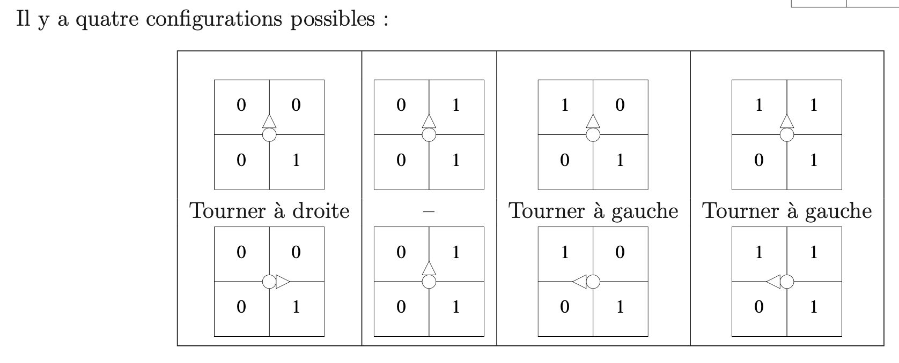

# Rapport final

## Tache 1 - Image Bitmap

### Structures de données

Dans cette tache pour la realisation des fonctions *ecrire_image* et *negatif_image* on utilise la structure de base d'une image bitmap qui est compose par le largeur de l'image, l'hauteur de l'image et un pointeur vers le tableu de pixels.

### Structure du programme

Pour le tache 1, le code principal des fonctions *ecrire_image* et *negatif_image* sont inclus sur le fichier *image.c* qui viens avec un fichier de liaisons *image.h*

### Difficultés, problems et resolutions

*Dans cette partie du rapport final on decrit en bullets les differents problems avec la resolution finale pour resoudre ce probleme, ainsi que differents points qu'on trouvé difficile pendant la realisation du tache.*

Pour le Tache 1:

* Utilisation du profil de l'image pour recuperer l'hauter et le largeur au lieu d'utiliser les fonctions déja definis au debut du projet (source code initial)
  * On a modifié le syntax sur nos fonctions *ecrire_image* et *negatif_image* pour faire une appelle aux fonctions hauteur_image et largeur_image.
* Retouner une image negative sans modification de l'image original
  * Initialisation d'une image en utilisant la fonction creer_image, tout en declarant son hauteur et largeur par rapport l'hauteur et le largeur de l'image initial.
* Probleme du bon lecture de l'image initial (soit pour effectuer un affichage sur le terminal en utilisant 0 et 1, soit pour creer le negatif de cette image) aux fonctions *ecrire_image* et *negatif_image*.
  * Initialisation de variable de parcours largeur-hauteur (boucle imbroques) à 1

    ```c
    for (int i=1; i<=hauteur; i++)
    	{
    		for (int j=1;j<=largeur; j++)
    		{ 
    ...
    ```

    au lieu de 0

    ```c
    for (int i=0; i<hauteur; i++)
    	{
    		for (int j=0;j<largeur; j++)
    		{
    ...
    ```
* Avoir une lecture des pixels le plus efficace pour les fonctions *ecrire_image* et *negatif_image*
  * Utilisation de la syntax switch(A), avec A le couleur du pixel en question
    ```c
    ...
    A = get_pixel_image(I, j, i);
    		switch(A)
    			{
    				case(BLANC):
    					...
    					break;
    				default:
    					...
    					break;
    			}
    ...
    ```

## Tache 2 - Géométrie 2D

### Structure du programme

Pour la meileur organisation des fichier de code, on a créé un nouveau fichier nome *geom2d.c* qui inclut tous les fonctions qui correspondent en calcul geometrique en dimension 2.

De plus, on a construit le fichier *geom2d.h* dans lequel on a declaré les structures de données utilisés par les modules sur *geom2d.c*. Aussi, ce fichier inclut le profil de chaque focntion ecrit sur *geom2d.c*

### Structures de données

Dans cette partie du projet, on aura besoin de declarer les types Vecteur et Point. Leur structure est donnes ci-dessous (*geom2d.h*)

```c
//Type Vecteur 
typedef struct Vecteur_
{
   double x,y;
} Vecteur;

//Type Point 
typedef struct Point_
{
   double x,y;
} Point;
```

### Difficultés, problems et resolutions

* Devrait utiliser des fonctiosn mathematiques en C. Par exemple: sqrt() pour la racine d'un nombre reel

  * On a definit *<math.h>* sur *geom2d.c*
* Choicir le bon typage pour les fonctions geometrqiues en plan de dimension 2

  * Utiliser le type double pour les fonctions de la norme, de la distance et du produit scalaire

## Tache 3 - Extraction d'un contour externe

### Structure du programme

Dans cette partie du projet, on a cree un nouveau fichier qui s'appele *contour.c*. À partir du cette tache, c'est cette fichier qu'on va mettre à jour majoritement. Pour le tache 3, on a declaré tous les fonctions necesaires pour l'extraction d'un contour externe via la methode d'un robot virtuel.

Ça veut dire qu'il s'agit des fonctions d'initialisation du robot, lecture de la position, mis à jour de ses coordones et orientation, declaration de l'agorithme pour l'extraction d'un seul contour, ainsi que la recherche du pixel de depart (pixel par lequel on va commencer de chercher pour un contour). Effectivement, le fichier contour.c viens avec le fichier contour.h qui inclut la declaration de la structure des donnes pour le robot virtuel et son orientation ainsi que les profils de tous les fonctions.

De plus, on a declaré un fichier qui s'appelle *sequence_point.c*. Il s'agit d'un fichier essentiel qui inclut tous les aides de traitment des structures des donnes declaré sur *sequence_point.h*. À partir de l'application de l'agorithme de contour (chercher pour un contour externe), on a besoin de stoquer tous les points du contour pour faire son extraction. C'est pourquoi, on a besoin de declarer des nouveaux types (structures des donnes).

Comme expliqué dans la partie ***structures de données - sequence_point.h***, l'utilisation des listes chainées est essentiel. Dans ce cadre la, les aides de traitment d'une liste des points s'agisent des fonctions de concatenation des listes, de suppresions des elements, initialisation d'une telle liste, ajouter elements dans une liste, ainsi que transformation d'une telle liste vers un tableau (qu'on aura besoin aux prochaines taches).

### Structures de données

#### sequence_point.h

Vu qu'on ne connait pas le nombre exact des points d'un contour externe, on a besoin de declarer une liste des points (contour) avec un taille dynamique. C'est pourquoi il est utilisé la syntax d'une liste chainé. Effectivement, une liste chaine est une chaine des cellules laquelle à son ensemble construit la liste chainé. Alors on a:

```c
...
/*---- le type cellule de liste de point ----*/
typedef struct Cellule_Liste_Point_
{
	Point data;    /* donn�e de l'�l�ment de liste */
	struct Cellule_Liste_Point_* suiv; /* pointeur sur l'�l�ment suivant */
} Cellule_Liste_Point;

/*---- le type liste de point ----*/
typedef struct Liste_Point_
{
	unsigned int taille;        /* nombre d'�l�ments dans la liste */
	Cellule_Liste_Point *first; /* pointeur sur le premier �l�ment de la liste */
	Cellule_Liste_Point *last;  /* pointeur sur le dernier �l�ment de la liste */
	                       /* first = last = NULL et taille = 0 <=> liste vide */
} Liste_Point;

typedef Liste_Point Contour; /* type Contour = type Liste_Point */
...
```

Pour la transformation d'une liste chaine vers un tableau, on a besoin de declarer le typage d'un tel tableau. Alors on a:

```c
...
/*---- le type tableau de point ----*/
typedef struct Tableau_Point_
{
	unsigned int taille; /* nombre d'�l�ments dans le tableau */
	Point *tab;          /* (pointeur vers) le tableau des �l�ments */
} Tableau_Point;
...
```

---

#### contour.h

On declare comme type enumere l'orientation qui peut etre pris par le robot. Après, on commence avec la declaration du robot virtuel qui a besoin des coordonees (x,y) et l'orientation. Alors on a:

```c
...
typedef enum {Nord, Est, Sud, Ouest} Orientation;

typedef struct {
  int x, y;
  Orientation o;
} Robot;
...
```

### Difficultés, problems et resolutions

* Trouver la signature de l'algo de contour (*algo_contour*)
  * On a decidé de prendre une image et un nom du fichier. En ce qui concerne le fichier, il s'agot d'un fichier .txt qui inclus les points d'un contour (tres utile pour la verification que la fonction marce comme attendue)
* Posibilité d'ecrire sur le fichier les differents points du contour sans lire le contour en utilisant des cellules vu que cette notion n'etait pas trés claire à notre tete pendant la periode de realisation de cette tache.
  * Transformation du contour (liste des points [liste chainé]) à un tableau. Aprés on fait un parcours normal du tableau, tout en ecrivant sur le fichier (*fptr*) le coordonees du chaque point (*P.x* et *P.y*)
    ```c
    ...
    Tableau_Point TP = sequence_points_liste_vers_tableau(c);
            int k;
            int nP = TP.taille;
            fprintf(fptr, "\n");
            fprintf(fptr, "%d\n", nP);
            for (k = 0; k < nP; k++)
            {
                Point P = TP.tab[k];
                fprintf(fptr, "%.1f %.1f\n", P.x, P.y);
            }
            free(TP.tab);
    ...
    ```
* Etablir une logique pour trouver le point de depart
  * Dans le cadre de la lecture de l'image original, si on trouve un pixel noir tel que son voisin en nord est blanch, on retourne cette pixel (ses coordones x et y) comme le point de depart. Pour le pixel voisin il suffit de regarder en meme largeur mais en hauteur-1 de notre pixel en question comme marqué ci-dessous:
    ```c
    ...
    case (NOIR):
                    if (j != largeur)
                    {
                        voisin = get_pixel_image(I, j, 
    ```
* L'agorithme de contour demande de calculer la nouvelle orientation du robot pour qu'on peut bien suivre le contour externe. La detection des bonnes pixels-voisin autour de notre pixel en question par rapport l'orientation du robot etait essentiel:
  * On a decidé d'avancer en divisant notre problem en 4 sous-cas qui dependent par l'orientation du notre robot. Après, en utilisant l'image "voisins d'un point (x,y)" on recupere les bonnes pixels voisins à gauche et à droit, et par rapport la logique expliqué sur l'image "configurations possibles", on decide la nouvelle orientation du robot.
    ")

    
    Alors on obtiens la loqique suivante:

    ```c
    ...
    switch (r->o)
        {
        case (Est):
            pG = get_pixel_image(I, x + 1, y);
            pD = get_pixel_image(I, x + 1, y + 1);
            if (pG == NOIR)
            {
                r->o = Nord;
                break;
            }
            else if (pD == BLANC)
            {
                r->o = Sud;
                break;
            }
            else
            {
                break;
            }
        case (Nord):
            pG = get_pixel_image(I, x, y);
            pD = get_pixel_image(I, x + 1, y);
            if (pG == NOIR)
            {
                r->o = Ouest;
                break;
            }
            else if (pD == BLANC)
            {
                r->o = Est;
                break;
            }
            else
            {
                break;
            }
        case (Sud):
            pG = get_pixel_image(I, x + 1, y + 1);
            pD = get_pixel_image(I, x, y + 1);
            if (pG == NOIR)
            {
                r->o = Est;
                break;
            }
            else if (pD == BLANC)
            {
                r->o = Ouest;
                break;
            }
            else
            {
                break;
            }
        case (Ouest):
            pG = get_pixel_image(I, x, y + 1);
            pD = get_pixel_image(I, x, y);
            if (pG == NOIR)
            {
                r->o = Sud;
                break;
            }
            else if (pD == BLANC)
            {
                r->o = Nord;
                break;
            }
            else
            {
                break;
            }
        }
    ...
    ```
* On avait un probleme par rapport le tournage à gauche ou à droit du robot
  * Effectivement, c'est l'orientation du robot qui change si on tourne à gauche ou à droit. Avec une ΣΟΒΑΡΗ reflection on a obtenu la logique suivante:
    ```c
    ...
    void tourner_a_gauche(Robot *r)
    {
        switch (r->o)
        {
        case Nord:
            r->o = Ouest;
            break;
        case Ouest:
            r->o = Sud;
            break;
        case Sud:
            r->o = Est;
            break;
        case Est:
            r->o = Nord;
            break;
        }
    }

    /* faire tourner le robot à droite */
    void tourner_a_droite(Robot *r)
    {
        switch (r->o)
        {
        case Nord:
            r->o = Est;
            break;
        case Ouest:
            r->o = Nord;
            break;
        case Sud:
            r->o = Ouest;
            break;
        case Est:
            r->o = Sud;
            break;
        }
    }
    ...
    ```

## Tache 4 - Sortie fichier au format EPS

### Structure du programme

Dans le fichier contour.c on ajouté les fonctions *create_postscript* et *create_postscript_fill* qui construit le fichier EPS. Effectivement, le fichier contour.h etait mis à jour avec les profils des nouveaux fonctions.

### Structures de données

Pas des nouvelles structures etait crée. On utilise la structure de données liste_point pour la realisation de cette tache.

### Difficultés, problems et resolutions

* Comment automatiser la processus de la creation et l'ouverture d'un fichier .EPS à partir d'un fichier .PBM passé en argument
  * Utilisation de la fonction pre-declare en C strtok pour recuperer le nom du fichier sans l'extension  .PBM, tout en allocant la memoire necesaire pour l'ajoute de l'extension .EPS en utilisant le malloc et creation du nom final avec l'extension .eps
    ```c
    ...
    // Extension managment
        char *no_extension = strtok(file_name, ".");
        char *with_extension = malloc(strlen(no_extension) + 4);
        strcpy(with_extension, no_extension);
        strcat(with_extension, ".eps");
    ...
    ```
* Image sur le fichier EPS etait affichè à l'invers
  * Modification de la valeur *y* d'un point avec hauteur de l'image moins ca valeur initial comme marqué ci-dessous:
    ```c
    ...
    Cellule_Liste_Point *el;
        el = c.first;
        fprintf(fptr, "%.0f %.0f moveto ", el->data.x, hauteur-el->data.y);
        el = el->suiv;
        while (el != NULL)
        {
            fprintf(fptr, "%.0f %.0f lineto ", el->data.x, hauteur-el->data.y);
            el = el->suiv;
        }
    ...
    ```
* N'oubliez pas d'ajouter le *setlinewidth* sur le fichier EPS
* Faire atention en mode de remplisage (fill ou stroke)

## Tache 5 - Extraction des contours d'un image

### Structure du programme

Dans le fichier contour.c on ajoute la fonction algo_contours qui renvoie la liste des contours pour un image. Pour etre capable de detecter tous les contours d'une image on a besoin le mask de l'image originale. Il s'agit d'une image qui a que les pixels noirs de l'image originale avec un voisin en nord blanche.

Alors, au lieu de chercher le point de depart de chaque contour dans l'image originale, on le cherche dans l'image mask qui est mis à jour chaque fois qu'un point est mis sur le contour en question.

Effectivement, on a besoin une maniere de detcter qu'il n'y plus des contours pour l'image orginale. C'est pourquoi, on a construit la fonction *image_mask* qui verifie si il y a ou pas des pixels noirs ou si l'image a que des pixels blanches. Si l'image mask a que des pixels blanches, alors ça veut dire qu'il n'y a pas d'autres contours.

Dans le cadre des compte rendus pour le Tache 5, on avait besoin d'ajouter quelques d'autres fonctions sur le fichier contour.c. Il s'agit des fonctions:

1. *ecrire_fichier_contours*: Creer un .TXT avec tous les contours au lieu d'un seul contour comme on avait fait en Tache 4
2. *contours_data*: Il affiche sur le terminal le nombre des contours et le nombre des segments totales
3. *create_postscript_contours*: Ecriture du fichier .EPS pour un multiple des conours

Evidement, les profils des nouveaux fonctions etaient ajouté sur contour.h

### Structures de données

Dans cette partie du projet, il y avait quelques additions des types sur le fichier sequence_point.h et des fonctions d'aide correspondante sue sequence_point.c. Pour etre capable de traiter le mupliple nombre des contours, on a construit un nouveau type nomé *Liste_Contours* qui est en fait une liste chainé des contours (liste_point).

Dans ce cadre là, on a construit le type Cellule_Liste_Contours qu'on a besoin de construire la liste chaine des contours. Vous pouvez trouver les structures de données consruit ci-dessous:

```c
...
/*---- le type cellule de liste de point ----*/
typedef struct Cellule_Liste_Point_
{
	Point data;    /* donn�e de l'�l�ment de liste */
	struct Cellule_Liste_Point_* suiv; /* pointeur sur l'�l�ment suivant */
} Cellule_Liste_Point;
...
typedef struct Liste_Contours_
{
	unsigned int taille;        /* nombre d'�l�ments dans la liste */
	Cellule_Liste_Contours *first; /* pointeur sur le premier �l�ment de la liste */
	Cellule_Liste_Contours *last;  /* pointeur sur le dernier �l�ment de la liste */
	                       /* first = last = NULL et taille = 0 <=> liste vide */
} Liste_Contours;
...
```

### Difficultés, problems et resolutions

* Faire le parcour de la liste des contours, tout en faisant le parcour de chaque contour dans le cadre de trouver le numero des contours et le numero des segments totales pour la fonction *contours_data*
  * On a decidé d'utiliser la methode de lecture par cellules. Alors on a:

    ```c
    ...
     Cellule_Liste_Contours *el;
        el = c.first;
        ..
        while (el != NULL)
        {
            ..
            Cellule_Liste_Point *e;
            e = (el->data).first;
            while (e != NULL)
            {
                ..
                e = e->suiv;
            }
            ..
            el = el->suiv;
        }
    ...
    ```
    .. corespond à d'autres parties du code qui n'ont pas une connection par le probleme mentioné
* Ecriture du fichier EPS pour un multiple des contours
  * On suivre la meme methode qu'au point d'avant (lecture en utilisant les cellules).
* Le pixel voisin pendant la lecture de l'image originale pour la construction de l'image
* sd
* sd
